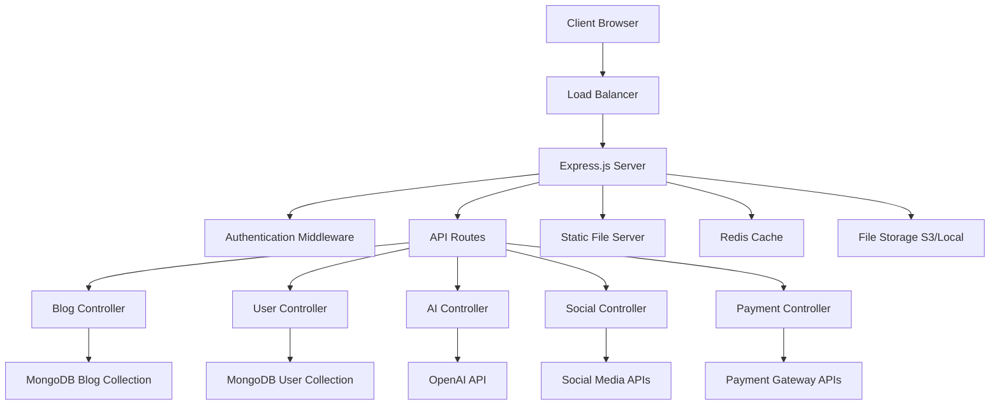

# Design Document

## Overview

Dokumen ini menjelaskan desain teknis untuk mengadopsi semua fitur dari aplikasi BEEPOS (Laravel-based) menjadi platform blog modern menggunakan Express.js fullstack dengan navigasi bahasa Indonesia. Sistem akan mengintegrasikan fitur-fitur canggih seperti AI content generation, social media management, analytics dashboard, payment system, dan multi-user management.

## Architecture

### High-Level Architecture



### Technology Stack

**Backend:**
- Node.js dengan Express.js framework
- MongoDB dengan Mongoose ODM
- Redis untuk caching dan session storage
- JWT untuk authentication
- Multer untuk file upload
- Socket.io untuk real-time notifications

**Frontend:**
- EJS template engine untuk server-side rendering
- Bootstrap 5 untuk responsive UI
- jQuery untuk interaktivitas
- Chart.js untuk analytics dashboard
- TinyMCE untuk rich text editor

**External Services:**
- OpenAI API untuk AI content generation
- Social Media APIs (Facebook, Twitter, Instagram, LinkedIn)
- Payment gateways (Stripe, PayPal, Midtrans)
- Email service (SendGrid/Nodemailer)
- SMS service (Twilio)

## Components and Interfaces

### 1. Authentication System

**Components:**
- `AuthController`: Mengelola login, register, password reset
- `AuthMiddleware`: Validasi JWT token dan role-based access
- `SocialAuthService`: Integrasi login dengan media sosial

**Interfaces:**
```javascript
// User Model Interface
{
  _id: ObjectId,
  username: String,
  email: String,
  password: String (hashed),
  role: Enum['admin', 'penulis', 'pembaca'],
  profile: {
    nama: String,
    foto: String,
    bio: String,
    socialLinks: Object
  },
  subscription: {
    plan: String,
    expiredAt: Date,
    features: Array
  },
  createdAt: Date,
  updatedAt: Date
}
```

### 2. Blog Management System

**Components:**
- `BlogController`: CRUD operations untuk artikel
- `CategoryController`: Manajemen kategori dan tag
- `MediaController`: Upload dan manajemen file media
- `CommentController`: Sistem komentar dengan moderasi

**Interfaces:**
```javascript
// Article Model Interface
{
  _id: ObjectId,
  judul: String,
  slug: String,
  konten: String,
  ringkasan: String,
  thumbnail: String,
  kategori: ObjectId,
  tags: [String],
  penulis: ObjectId,
  status: Enum['draft', 'published', 'archived'],
  metadata: {
    views: Number,
    likes: Number,
    shares: Number,
    readTime: Number
  },
  seo: {
    metaTitle: String,
    metaDescription: String,
    keywords: [String]
  },
  publishedAt: Date,
  createdAt: Date,
  updatedAt: Date
}
```

### 3. AI Content Generation

**Components:**
- `AiController`: Integrasi dengan OpenAI API
- `TemplateService`: Manajemen template AI
- `ContentProcessor`: Post-processing hasil AI

**Features:**
- Generate artikel berdasarkan topik
- Generate gambar untuk artikel
- Optimize SEO content
- Translate content ke bahasa lain#
## 4. Social Media Integration

**Components:**
- `SocialAccountController`: Manajemen akun media sosial
- `SocialPostController`: Auto-posting ke berbagai platform
- `SocialAnalyticsService`: Tracking engagement metrics

**Supported Platforms:**
- Facebook Pages & Groups
- Twitter/X
- Instagram
- LinkedIn
- TikTok
- YouTube

### 5. Analytics Dashboard

**Components:**
- `AnalyticsController`: Aggregasi data statistik
- `ReportService`: Generate laporan berkala
- `MetricsCollector`: Real-time data collection

**Metrics Tracked:**
- Page views dan unique visitors
- Article engagement (likes, shares, comments)
- User behavior dan reading patterns
- Social media performance
- Revenue dan subscription metrics

### 6. Payment & Subscription System

**Components:**
- `PaymentController`: Proses pembayaran
- `SubscriptionService`: Manajemen langganan
- `InvoiceGenerator`: Generate invoice otomatis

**Payment Methods:**
- Credit/Debit Cards (Stripe)
- PayPal
- Bank Transfer (Midtrans untuk Indonesia)
- E-wallet (GoPay, OVO, DANA)

## Data Models

### Core Collections

**1. Users Collection**
```javascript
{
  _id: ObjectId,
  username: { type: String, unique: true, required: true },
  email: { type: String, unique: true, required: true },
  password: { type: String, required: true },
  role: { type: String, enum: ['admin', 'penulis', 'pembaca'], default: 'pembaca' },
  profile: {
    nama: String,
    foto: { type: String, default: '/images/default-avatar.png' },
    bio: String,
    socialLinks: {
      facebook: String,
      twitter: String,
      instagram: String,
      linkedin: String
    }
  },
  subscription: {
    plan: { type: String, enum: ['free', 'premium', 'pro'], default: 'free' },
    expiredAt: Date,
    features: [String],
    autoRenew: { type: Boolean, default: false }
  },
  preferences: {
    language: { type: String, default: 'id' },
    timezone: { type: String, default: 'Asia/Jakarta' },
    notifications: {
      email: { type: Boolean, default: true },
      push: { type: Boolean, default: true }
    }
  },
  stats: {
    articlesPublished: { type: Number, default: 0 },
    totalViews: { type: Number, default: 0 },
    totalLikes: { type: Number, default: 0 }
  },
  isActive: { type: Boolean, default: true },
  emailVerified: { type: Boolean, default: false },
  lastLogin: Date,
  createdAt: { type: Date, default: Date.now },
  updatedAt: { type: Date, default: Date.now }
}
```

**2. Articles Collection**
```javascript
{
  _id: ObjectId,
  judul: { type: String, required: true },
  slug: { type: String, unique: true, required: true },
  konten: { type: String, required: true },
  ringkasan: String,
  thumbnail: String,
  kategori: { type: ObjectId, ref: 'Category', required: true },
  tags: [String],
  penulis: { type: ObjectId, ref: 'User', required: true },
  status: { type: String, enum: ['draft', 'published', 'archived'], default: 'draft' },
  featured: { type: Boolean, default: false },
  premium: { type: Boolean, default: false },
  metadata: {
    views: { type: Number, default: 0 },
    likes: { type: Number, default: 0 },
    shares: { type: Number, default: 0 },
    comments: { type: Number, default: 0 },
    readTime: Number
  },
  seo: {
    metaTitle: String,
    metaDescription: String,
    keywords: [String],
    canonicalUrl: String
  },
  socialMedia: {
    autoPost: { type: Boolean, default: false },
    platforms: [String],
    customMessage: String
  },
  publishedAt: Date,
  scheduledAt: Date,
  createdAt: { type: Date, default: Date.now },
  updatedAt: { type: Date, default: Date.now }
}
```

**3. Categories Collection**
```javascript
{
  _id: ObjectId,
  nama: { type: String, required: true },
  slug: { type: String, unique: true, required: true },
  deskripsi: String,
  icon: String,
  color: String,
  parent: { type: ObjectId, ref: 'Category' },
  isActive: { type: Boolean, default: true },
  sortOrder: { type: Number, default: 0 },
  createdAt: { type: Date, default: Date.now },
  updatedAt: { type: Date, default: Date.now }
}
```

**4. Comments Collection**
```javascript
{
  _id: ObjectId,
  artikel: { type: ObjectId, ref: 'Article', required: true },
  penulis: { type: ObjectId, ref: 'User', required: true },
  konten: { type: String, required: true },
  parent: { type: ObjectId, ref: 'Comment' },
  status: { type: String, enum: ['pending', 'approved', 'rejected'], default: 'pending' },
  likes: { type: Number, default: 0 },
  createdAt: { type: Date, default: Date.now },
  updatedAt: { type: Date, default: Date.now }
}
```

**5. Social Accounts Collection**
```javascript
{
  _id: ObjectId,
  user: { type: ObjectId, ref: 'User', required: true },
  platform: { type: String, enum: ['facebook', 'twitter', 'instagram', 'linkedin', 'tiktok', 'youtube'], required: true },
  accountId: String,
  accountName: String,
  accessToken: String,
  refreshToken: String,
  tokenExpiry: Date,
  isActive: { type: Boolean, default: true },
  lastSync: Date,
  createdAt: { type: Date, default: Date.now },
  updatedAt: { type: Date, default: Date.now }
}
```

## Error Handling

### Error Response Format
```javascript
{
  success: false,
  error: {
    code: 'ERROR_CODE',
    message: 'Human readable message in Indonesian',
    details: 'Technical details for debugging',
    timestamp: '2024-01-01T00:00:00.000Z'
  }
}
```

### Error Categories
1. **Authentication Errors** (401)
   - Invalid credentials
   - Token expired
   - Insufficient permissions

2. **Validation Errors** (400)
   - Missing required fields
   - Invalid data format
   - Business rule violations

3. **Resource Errors** (404)
   - Article not found
   - User not found
   - Category not found

4. **Server Errors** (500)
   - Database connection issues
   - External API failures
   - Unexpected system errors

### Error Handling Middleware
```javascript
const errorHandler = (err, req, res, next) => {
  const error = {
    success: false,
    error: {
      code: err.code || 'INTERNAL_ERROR',
      message: err.message || 'Terjadi kesalahan sistem',
      timestamp: new Date().toISOString()
    }
  };
  
  if (process.env.NODE_ENV === 'development') {
    error.error.details = err.stack;
  }
  
  res.status(err.statusCode || 500).json(error);
};
```## Test
ing Strategy

### 1. Unit Testing
**Framework:** Jest dengan Supertest untuk API testing

**Coverage Areas:**
- Model validation dan business logic
- Controller functions
- Utility functions
- Authentication middleware

**Example Test Structure:**
```javascript
describe('BlogController', () => {
  describe('createArticle', () => {
    it('should create article with valid data', async () => {
      // Test implementation
    });
    
    it('should reject article without title', async () => {
      // Test implementation
    });
  });
});
```

### 2. Integration Testing
**Focus Areas:**
- API endpoint functionality
- Database operations
- External service integrations
- Authentication flows

**Test Database:**
- Separate MongoDB instance for testing
- Automated data seeding and cleanup
- Mock external APIs when necessary

### 3. End-to-End Testing
**Framework:** Playwright atau Cypress

**Test Scenarios:**
- User registration dan login flow
- Article creation dan publishing
- Comment system functionality
- Payment processing
- Social media integration

### 4. Performance Testing
**Tools:** Artillery.js untuk load testing

**Metrics to Monitor:**
- Response time untuk API endpoints
- Database query performance
- Memory usage dan CPU utilization
- Concurrent user handling

### 5. Security Testing
**Areas to Test:**
- SQL injection prevention
- XSS protection
- CSRF protection
- Authentication bypass attempts
- File upload security

## Navigation Structure (Bahasa Indonesia)

### Public Navigation
```
Beranda
├── Artikel Terbaru
├── Kategori
│   ├── Teknologi
│   ├── Bisnis
│   ├── Lifestyle
│   └── Tutorial
├── Tentang Kami
├── Kontak
└── Masuk/Daftar
```

### User Dashboard Navigation
```
Dashboard Pembaca
├── Beranda
├── Artikel Favorit
├── Riwayat Baca
├── Komentar Saya
├── Profil
├── Langganan
└── Pengaturan
```

### Author Dashboard Navigation
```
Dashboard Penulis
├── Beranda
├── Artikel Saya
│   ├── Semua Artikel
│   ├── Draft
│   ├── Terpublikasi
│   └── Arsip
├── Statistik
├── Komentar
├── Media
├── Profil Penulis
└── Pengaturan
```

### Admin Dashboard Navigation
```
Dashboard Admin
├── Beranda
├── Manajemen Konten
│   ├── Artikel
│   ├── Kategori
│   ├── Komentar
│   └── Media
├── Manajemen Pengguna
│   ├── Semua Pengguna
│   ├── Penulis
│   ├── Admin
│   └── Pembaca
├── AI Content
│   ├── Template AI
│   ├── Riwayat Generate
│   └── Pengaturan AI
├── Media Sosial
│   ├── Akun Terhubung
│   ├── Postingan
│   └── Analitik
├── Keuangan
│   ├── Langganan
│   ├── Pembayaran
│   ├── Laporan
│   └── Pengaturan Payment
├── Analitik
│   ├── Traffic
│   ├── Engagement
│   ├── Revenue
│   └── Laporan
├── Komunikasi
│   ├── Newsletter
│   ├── Notifikasi
│   └── Support Ticket
├── Pengaturan Sistem
│   ├── Umum
│   ├── SEO
│   ├── Keamanan
│   ├── Email
│   ├── SMS
│   └── Backup
└── Keluar
```

## Security Considerations

### 1. Authentication & Authorization
- JWT tokens dengan expiry time
- Role-based access control (RBAC)
- Multi-factor authentication untuk admin
- Session management dengan Redis

### 2. Data Protection
- Password hashing dengan bcrypt
- Input sanitization dan validation
- SQL injection prevention
- XSS protection dengan helmet.js

### 3. API Security
- Rate limiting untuk prevent abuse
- CORS configuration
- API key authentication untuk external access
- Request size limiting

### 4. File Upload Security
- File type validation
- File size limits
- Virus scanning integration
- Secure file storage dengan proper permissions

### 5. Infrastructure Security
- HTTPS enforcement
- Security headers implementation
- Regular security updates
- Database access restrictions
- Environment variables untuk sensitive data

## Performance Optimization

### 1. Caching Strategy
- Redis untuk session dan frequently accessed data
- Browser caching untuk static assets
- CDN integration untuk global content delivery
- Database query result caching

### 2. Database Optimization
- Proper indexing untuk frequently queried fields
- Connection pooling
- Query optimization
- Database sharding untuk large datasets

### 3. Frontend Optimization
- Asset minification dan compression
- Image optimization dan lazy loading
- Progressive Web App (PWA) features
- Service worker untuk offline functionality

### 4. Server Optimization
- Load balancing dengan multiple instances
- Horizontal scaling capability
- Memory management
- CPU optimization

## Deployment Architecture

### 1. Development Environment
- Local MongoDB instance
- Local Redis instance
- Environment variables untuk configuration
- Hot reloading untuk development

### 2. Staging Environment
- Docker containers untuk consistency
- Automated testing pipeline
- Database migrations
- Performance monitoring

### 3. Production Environment
- Container orchestration dengan Docker Swarm/Kubernetes
- Load balancer (Nginx/HAProxy)
- Database clustering
- Automated backup system
- Monitoring dan alerting system

### 4. CI/CD Pipeline
- Automated testing pada setiap commit
- Code quality checks
- Security vulnerability scanning
- Automated deployment ke staging
- Manual approval untuk production deployment